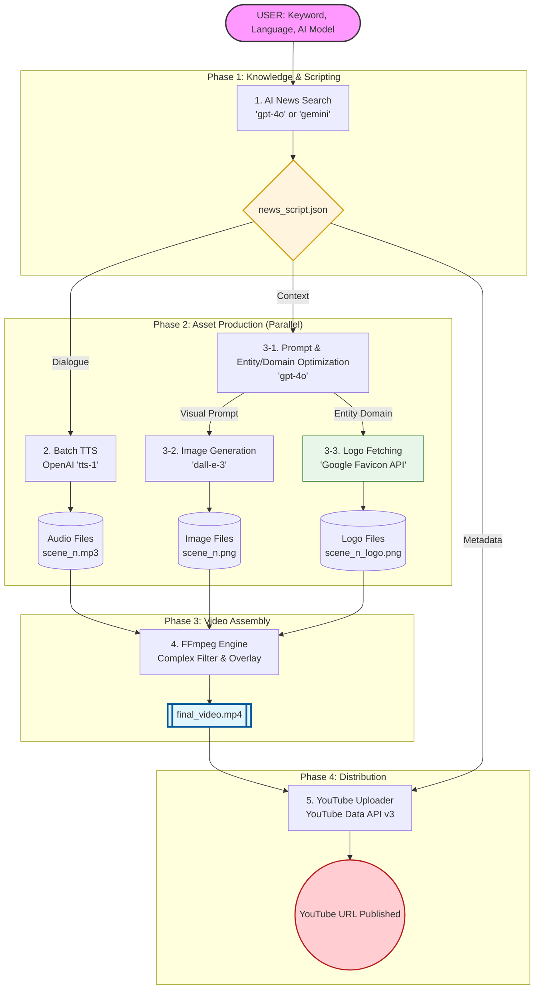

# 기술 상세 문서 (Technical Documentation)

이 문서는 AI 뉴스 영상 자동화 파이프라인의 상세 구현 기술과 개발 방법론을 설명합니다.

## 1. 전체 파이프라인 흐름 (Flowchart)

---

## 2. 모듈별 동작 원리 및 AI 서비스

### 2.1 뉴스 검색 및 대본 생성
*   **사용 서비스**: OpenAI `gpt-4o` 또는 Google `gemini-2.0-flash-lite`
*   **동작 원리**: 사용자가 입력한 키워드를 바탕으로 최신 뉴스를 수집하고, 두 명의 앵커(`Anchor A`, `Anchor B`)가 대화하는 형식의 스크립트(JSON)를 생성합니다. 다국어 파라미터를 통해 한국어/영어 선택이 가능합니다.

### 2.2 음성 합성 (Batch TTS)
*   **사용 서비스**: OpenAI `tts-1`
*   **동작 원리**: 대본의 각 라인을 전용 목소리(`onyx`, `nova`)로 변환합니다. 개별 MP3 파일로 저장하여 후속 합성 단계에서 정교한 타이밍 조절이 가능하게 합니다.

### 2.3 프롬프트 최적화 및 이미지 생성
*   **사용 서비스**: OpenAI `gpt-4o` (프롬프트 요약), `dall-e-3` (이미지 생성)
*   **동작 원리**: 대사 내용을 그대로 프롬프트로 쓰지 않고, GPT-4o가 시각적 묘사 위주로 요약하여 DALL-E 3에 전달합니다.
*   **하이브리드 엔티티 추출 및 로고 합성**: 
    *   **추출**: GPT-4o가 뉴스 대본에서 기업명(`entity`)과 해당 기업의 공식 웹사이트 도메인(`domain`)을 자동으로 식별합니다. (예: Samsung -> samsung.com)
    *   **로고 검색 일반화**: 식별된 도메인을 바탕으로 **Google Favicon API** (또는 Clearbit)를 호출하여 실시간으로 공식 로고를 수집합니다. 이를 통해 하드코딩 없이 전 세계 모든 기업의 로고를 대응합니다.
    *   **합성**: 수집된 로고가 존재할 경우, FFmpeg의 `filter_complex`를 사용하여 생성된 배경 이미지의 우측 상단(설정 가능)에 레이어로 오버레이합니다. 이를 통해 DALL-E가 생성하기 힘든 브랜드 아이덴티티의 정확도를 100% 보완합니다.

### 2.4 고성능 영상 합성 (Assembly)
*   **사용 도구**: FFmpeg
*   **동작 원리**: `ffprobe`로 오디오 길이를 계산하고, 이미지와 매칭하여 실시간으로 인코딩합니다. 복합 필터(`filter_complex`)를 사용해 모든 장면을 결합하고 1920x1080 해상도로 출력합니다.

### 2.5 YouTube 자동 게시
*   **사용 서비스**: Google YouTube Data API v3
*   **동작 원리**: OAuth2 인증을 통해 영상을 업로드합니다. 대본의 요약본을 본문으로 사용하며, 초기에는 `unlisted` 상태로 게시하여 안정성을 확보합니다.

---

## 3. 개발 방법론: TDD (Test-Driven Development)

본 프로젝트는 모든 모듈을 TDD 방식으로 개발하여 외부 API 의존성 없이 로직을 검증합니다.

### 모킹(Mocking) 전략
- **OpenAI/Gemini API**: `jest.mock`을 통해 실제 API 호출 없이 JSON 응답 검증.
- **File System**: `fs` 모듈 모킹으로 디스크 I/O 없이 로직 검증.
- **FFmpeg**: `spawn` 인자 구성을 테스트하여 커맨드라인 무결성 확인.

---

## 4. Windmill 통합 및 확장성

### 워커 환경 (`Dockerfile.windmill_worker`)
FFmpeg이 포함된 커스텀 이미지를 통해 컨테이너 기반 워커에서 영상 합성을 수행합니다.

### Flow 데이터 흐름
- **임시 저장소 공유**: `./videos` 공용 볼륨을 마운트하여 컨테이너 간 대용량 데이터 전송 및 처리 속도를 극대화했습니다.

---

## 5. 중앙 설정 시스템 상세 가이드 (`config.json`)

본 프로젝트의 모든 핵심 로직은 `config.json`을 통해 제어됩니다. 하드코딩을 배제하고 설정파일 수지만으로 파이프라인의 성격을 변경할 수 있습니다.

### 5.1 `imageGeneration` (이미지 생성 지침)
*   **`model`**: 사용 모델 (`dall-e-3` 고정 권장).
*   **`size`**: 이미지 해상도. 유튜브 규격에 맞는 `1792x1024` (가로형) 권장.
*   **`style`**: 모든 장면에 공통으로 적용될 시각적 스타일 테마. (예: "Flat design", "Oil painting")
*   **`optimizationPrompt`**: 대본 텍스트를 DALL-E 전용 묘사로 변환할 때 GPT-4o에게 주는 시스템 프롬프트입니다.
    *   **핵심 역할**: 시각적 묘사와 더불어 로고 합성을 위한 `entity`(기업명) 및 `domain` 도메인 정보를 추출하도록 설계되어 있습니다.

### 5.2 `tts` (음성 합성 설정)
*   **`model`**: 사용 모델 (`tts-1` 또는 `tts-1-hd`).
*   **`voices`**: 각 앵커(`Anchor A`, `Anchor B`)에게 부여할 목소리 ID입니다. OpenAI의 `onyx`, `nova`, `shimmer` 등을 사용할 수 있습니다.

### 5.3 `pipeline` (AI 비즈니스 로직)
*   **`defaultLanguage`**: 기본 생성 언어 (`Korean`, `English`).
*   **`openaiModel` / `geminiModel`**: 각 서비스별로 사용할 모델 버전 명시.
*   **`scriptDuration`**: **중요!** 영상의 목표 분량을 설정합니다. (예: "1-minute", "2-minute")
*   **`newsSearchPrompt`**: 뉴스를 수집하여 대본으로 가공할 때의 마스터 프롬프트입니다. 
    *   **템플릿 변수**: `${keyword}`, `${language}`, `${duration}` 변수가 코드 레벨에서 동적으로 치환됩니다.

### 5.4 `videoSettings` (출력 영상 품질)
*   **`width` / `height`**: 최종 영상 해상도 (기본 1920x1080).
*   **`outputFileName`**: 생성될 파일명.

### 5.5 `logoOverlay` (하이브리드 로고 합성)
*   **`enabled`**: 로고 합성 기능 활성화 여부.
*   **`position`**: 로고 위치 (`top-right`, `top-left` 등).
*   **`margin`**: 화면 끝에서의 간격(px).
*   **`width`**: 합성될 로고의 가로 크기(px). 세로는 비율에 맞춰 자동 조절됩니다.
*   **`fallbackLogos`**: 도메인 추출 실패 시를 대비한 수동 브랜드 로고 매핑 리스트입니다. 기업명에 해당 키워드가 포함되면 정의된 URL의 이미지를 우선 사용합니다.

---

## 6. 트러블슈팅 기록

### FFmpeg 에러: "Too many inputs specified for the scale filter"
- **해결**: 필터 체인에서 `scaleFilters`와 `concatInputs` 문자열을 명확히 분리하여 구문 오류를 해결했습니다.

### DALL-E 에러: "Protocol http: not supported"
- **해결**: 테스트 환경의 Mock URL을 `https`로 통일하고 인터페이스 참조 방식을 개선하여 해결했습니다.

### Logo Fetching: "ENOTFOUND logo.clearbit.com"
- **원인**: 특정 네트워크 환경에서 Clearbit API 접근 제한 발생.
- **해결**: 범용성이 더 높은 `Google Favicon V2 API`로 전환하고, `128px` 고화질 아이콘을 추출하도록 로직을 일반화하였습니다.
