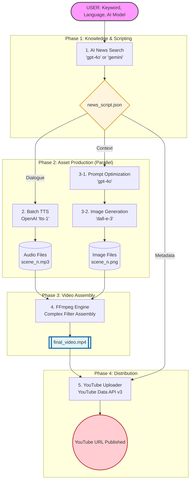

# 기술 상세 문서 (Technical Documentation)

이 문서는 AI 뉴스 영상 자동화 파이프라인의 상세 구현 기술과 개발 방법론을 설명합니다.

## 1. 전체 파이프라인 흐름 (Flowchart)

---

## 2. 모듈별 동작 원리 및 AI 서비스

### 2.1 뉴스 검색 및 대본 생성
*   **사용 서비스**: OpenAI `gpt-4o` 또는 Google `gemini-2.0-flash-lite`
*   **동작 원리**: 사용자가 입력한 키워드를 바탕으로 최신 뉴스를 수집하고, 두 명의 앵커(`Anchor A`, `Anchor B`)가 대화하는 형식의 스크립트(JSON)를 생성합니다. 다국어 파라미터를 통해 한국어/영어 선택이 가능합니다.

### 2.2 음성 합성 (Batch TTS)
*   **사용 서비스**: OpenAI `tts-1`
*   **동작 원리**: 대본의 각 라인을 전용 목소리(`onyx`, `nova`)로 변환합니다. 개별 MP3 파일로 저장하여 후속 합성 단계에서 정교한 타이밍 조절이 가능하게 합니다.

### 2.3 프롬프트 최적화 및 이미지 생성
*   **사용 서비스**: OpenAI `gpt-4o` (프롬프트 요약), `dall-e-3` (이미지 생성)
*   **동작 원리**: 대사 내용을 그대로 프롬프트로 쓰지 않고, GPT-4o가 시각적 묘사 위주로 요약하여 DALL-E 3에 전달합니다. 이를 통해 이미지 내 불필요한 텍스트 발생을 억제하고 고품질 뉴스 배경을 생성합니다.

### 2.4 고성능 영상 합성 (Assembly)
*   **사용 도구**: FFmpeg
*   **동작 원리**: `ffprobe`로 오디오 길이를 계산하고, 이미지와 매칭하여 실시간으로 인코딩합니다. 복합 필터(`filter_complex`)를 사용해 모든 장면을 결합하고 1920x1080 해상도로 출력합니다.

### 2.5 YouTube 자동 게시
*   **사용 서비스**: Google YouTube Data API v3
*   **동작 원리**: OAuth2 인증을 통해 영상을 업로드합니다. 대본의 요약본을 본문으로 사용하며, 초기에는 `unlisted` 상태로 게시하여 안정성을 확보합니다.

---

## 3. 개발 방법론: TDD (Test-Driven Development)

본 프로젝트는 모든 모듈을 TDD 방식으로 개발하여 외부 API 의존성 없이 로직을 검증합니다.

### 모킹(Mocking) 전략
- **OpenAI/Gemini API**: `jest.mock`을 통해 실제 API 호출 없이 JSON 응답 검증.
- **File System**: `fs` 모듈 모킹으로 디스크 I/O 없이 로직 검증.
- **FFmpeg**: `spawn` 인자 구성을 테스트하여 커맨드라인 무결성 확인.

---

## 4. Windmill 통합 및 확장성

### 워커 환경 (`Dockerfile.windmill_worker`)
FFmpeg이 포함된 커스텀 이미지를 통해 컨테이너 기반 워커에서 영상 합성을 수행합니다.

### Flow 데이터 흐름
- **임시 저장소 공유**: `./videos` 공용 볼륨을 마운트하여 컨테이너 간 대용량 데이터 전송 및 처리 속도를 극대화했습니다.

---

## 5. 설정 시스템 (`config.json`)

하드코딩을 최소화하고 유연한 운영을 위해 중앙 집중식 설정 파일을 사용합니다.

### 5.1 주요 설정 항목
*   **imageGeneration**:
    *   `model`: DALL-E 모델 버전 (`dall-e-3`)
    *   `size`: 이미지 해상도 (가로형 `1792x1024` 권장)
    *   `style`: 모든 이미지에 공통 적용될 예술적 스타일
    *   `optimizationPrompt`: 대본을 시각적 묘사로 변환할 때의 AI 지침
*   **tts**: 사용할 모델 및 앵커별 목소리(`onyx`, `nova` 등) 지정
*   **videoSettings**: 출력 영상의 해상도 및 파일명 설정
*   **pipeline**: 뉴스 검색 시 사용되는 모델 및 시스템 프롬프트 템플릿

---

## 6. 트러블슈팅 기록

### FFmpeg 에러: "Too many inputs specified for the scale filter"
- **해결**: 필터 체인에서 `scaleFilters`와 `concatInputs` 문자열을 명확히 분리하여 구문 오류를 해결했습니다.

### DALL-E 에러: "Protocol http: not supported"
- **해결**: 테스트 환경의 Mock URL을 `https`로 통일하고 인터페이스 참조 방식을 개선하여 해결했습니다.
